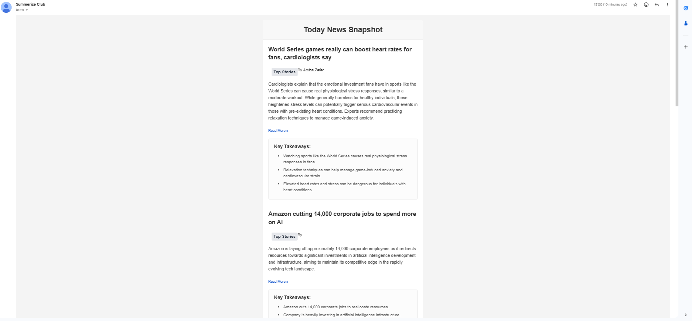
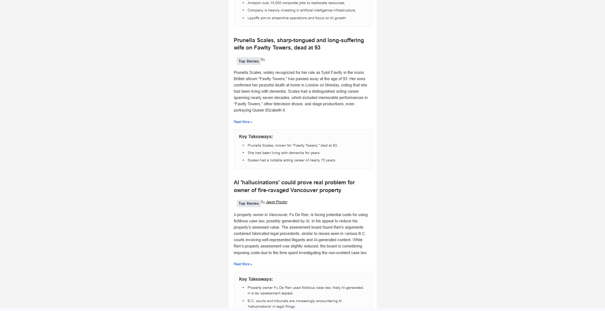

# AINewsSummarization
Keep updated with new summaries

## Project Description
AINewsSummarization is a tool/application designed to automatically gather news articles and generate concise summaries using AI‑powered techniques. It enables users to stay informed by providing distilled versions of news stories, saving time and highlighting key points. Try out the project [here](https://summerizenews.club/)

## Technology Use
- Frontend: React, Next.js, TailwindCSS
- Backend: Python, SQLAlchemy
- Models: Google gemini Lite
- Deployment: Docker, Verecl, DigitalOcean droplet

## Directory Structure (high‑level)
```
├── main.py
├── requirements.txt
├── Dockerfile
├── docker-compose.yml
├── frontend/
├── libs/
├── models/
├── tasks/
└── configs/
```
- `frontend/`: UI code (TypeScript/HTML/CSS)  
- `models/`: Database models
- `tasks/`: Scheduled and batch jobs 
- `configs/`: Configuration files (API keys, endpoints)
- `libs/`: reusable logics

## Sample Result





